# Live Data, Historical Warehouse, and Events

This document is the single source of truth for how Lumina mocks a live
price feed, how live ticks merge with historical (warehouse) data on the
candlestick chart, how the in-memory cache layer works, and how the
"chart events" feature (the annotation markers on the chart) flows from
the web dashboard into the Flutter app. It also lists efficiency
opportunities and a unit-test plan against the underlying business
logic.

The diagrams are written in Mermaid. They render natively in GitHub,
GitLab, and most modern Markdown viewers.

---

## Table of Contents

1. [Executive Summary](#executive-summary)
2. [Architecture at a Glance](#architecture-at-a-glance)
3. [Live Ticker Mocking](#live-ticker-mocking)
4. [Historical Warehouse API](#historical-warehouse-api)
5. [The Cache: `HistoricalTickCache`](#the-cache-historicaltickcache)
6. [Merging Live + Historical on the Chart](#merging-live--historical-on-the-chart)
7. [The Sparkline Path (Markets List)](#the-sparkline-path-markets-list)
8. [Chart Events: Add, Read, Poll](#chart-events-add-read-poll)
9. [Concurrency & Off-Main-Thread Work](#concurrency--off-main-thread-work)
10. [Efficiency Opportunities](#efficiency-opportunities)
11. [Unit Test Plan](#unit-test-plan)
12. [Glossary](#glossary)

---

## Executive Summary

The app deliberately separates **two data planes** and keeps them
loosely coupled:

| Plane          | Source                             | Cardinality                    | Update model               |
| -------------- | ---------------------------------- | ------------------------------ | -------------------------- |
| **Live**       | `LivePriceFeed` (in-process mock)  | One stream, all symbols        | Push (broadcast stream)    |
| **Historical** | `HistoricalPriceApi` + cache       | Stateless `[start, end)` query | Pull (await per range)     |
| **Events**     | Express `/v1/events` over Supabase | Per-symbol rows                | Window-fetch + 1 s polling |

The two price planes are **stitched together at the bloc layer** —
`ChartBloc` issues an initial historical fetch, hands the result to a
candle aggregator, then flips on a live tick subscription that
incrementally folds new ticks into the latest candle. The contract that
lets this work seamlessly is that **both planes derive their prices
from the same deterministic `PriceNoise` curve** (seeded off the
asset's symbol) — so the boundary between "synthesized history" and
"live tick" is bit-for-bit continuous.

Events are an **independent third plane** that the chart layers on top
of the candles via marker overlays. The chart pulls a window of events
on initial load and then issues a strict-greater-than delta poll once
per second; the dashboard in `_x/web` is the only writer.

---

## Architecture at a Glance

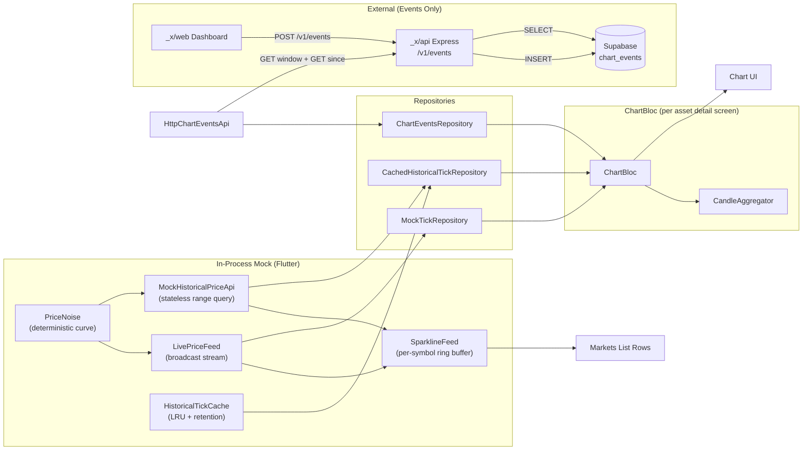

Key design rule: **`PriceNoise` is the single point of agreement
between live and historical.** Every other component is allowed to
diverge in implementation as long as it routes through one of those
two surfaces.

---

## Live Ticker Mocking

### The pieces

`LivePriceFeed` is the single source of truth for "what is the
price of X right now". It owns:

- A map of `symbol → PriceNoise`. Each `PriceNoise` is a layered Perlin
  noise function over time — see `lib/data/services/price_noise.dart`.
  The seed is `globalSeed XOR symbol.hashCode`, so the curve is
  **deterministic and stable across hot-restarts**.
- A current price snapshot map (the value any synchronous read returns).
- A per-symbol **list of timestamped offset events** (for the debug
  "price pump" dial).
- A randomised timer that fires every 200 – 1000 ms (scaled by a speed
  multiplier) and broadcasts a `LivePriceUpdate` to every subscriber.

### Why a step-function offset, not a single value

The debug "price pump" dial is modelled as an append-only list of
`OffsetEvent { timestamp, offset }`. When we ask for the price at
time `t`, we walk the list and take the latest event whose timestamp
is ≤ `t`. This makes the dial behave like a real-world spike: prices
**before** the press stay where they were, prices **from the press
forward** show the new offset. Paging back through history reveals a
clean step at the moment of the press instead of the entire historical
curve sliding up or down.

This matters for the merge story: because `priceAt(t)` is time-aware,
the historical synthesizer can bake in whichever offset was active at
each historical timestamp, and the live feed doesn't have to retro-
actively shift any cached data.

### The tick loop

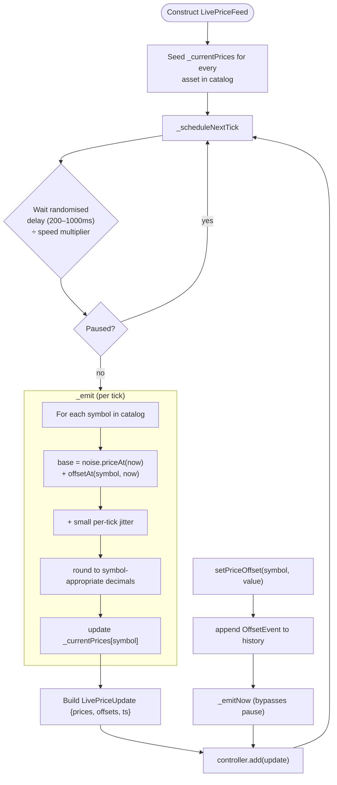

### Price = noise + offset, formally

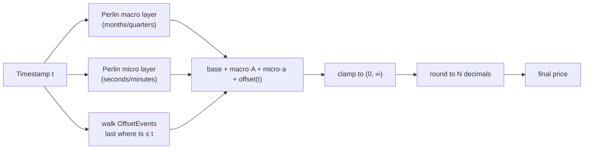

Three properties fall out of this design:

1. **Deterministic** — same `(symbol, t)` pair always yields the same
   price (modulo dial events).
2. **Continuous across the live/historical boundary** — the historical
   synthesizer and the live feed call the _same_ `noise.priceAt(t)`.
3. **Time-aware offsets** — past prices stay frozen even when the user
   dials a new offset right now.

---

## Historical Warehouse API

`HistoricalPriceApi` is a **stateless** `[start, end)` query over
historical ticks. The mock implementation
(`MockHistoricalPriceApi`) synthesizes ticks on demand from the same
`PriceNoise` the live feed uses, with **age-tiered density**:

| Age of tick    | Tick interval |
| -------------- | ------------- |
| ≤ 1 hour       | 1 s           |
| 1 hour – 1 day | 60 s          |
| 1 – 30 days    | 30 min        |
| > 30 days      | 6 hours       |

Each "anchor" interval emits 6 sub-ticks with light jitter so OHLC
candles always have intra-bucket variation rather than collapsing to a
single flat-line tick.

The synthesis loop runs **on a background isolate** via
`runOffMain` whenever the ballpark tick count crosses ~2000, so a 24-h
fetch (~30 k ticks) doesn't drop frames on the UI thread.

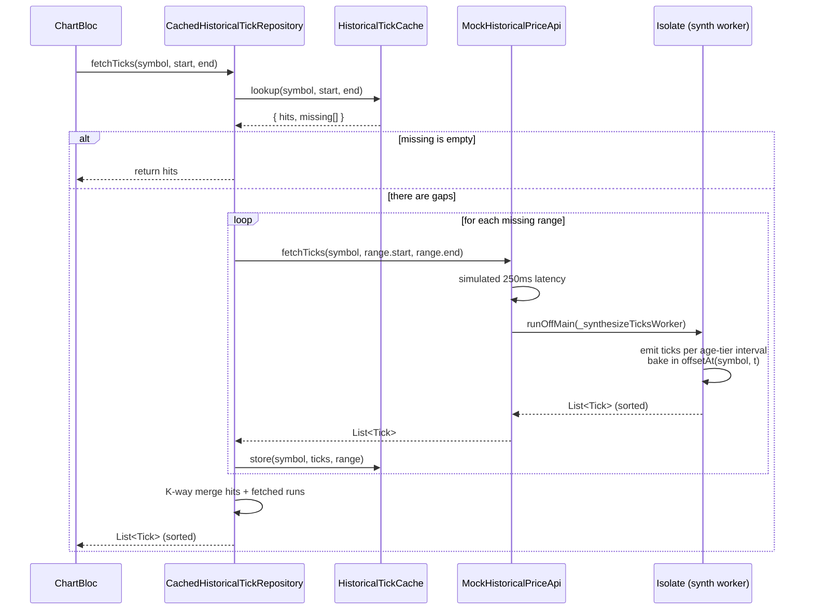

There is a second specialized entry point —
`fetchSparklineSamples(...)` — which does both synthesis **and**
down-sampling inside the same isolate and returns only the small final
`List<double>` to the main thread. This avoids ever materialising a
30 k `Tick` array on the UI thread for the markets-list mini graphs.

---

## The Cache: `HistoricalTickCache`

The cache lives between the bloc and the API and serves two purposes:

1. Avoid re-synthesizing the same time window twice (cost reduction).
2. Allow the bloc to render _something_ immediately when switching
   assets — `peekTicks` is a synchronous hit-or-miss read.

### Two layered eviction policies

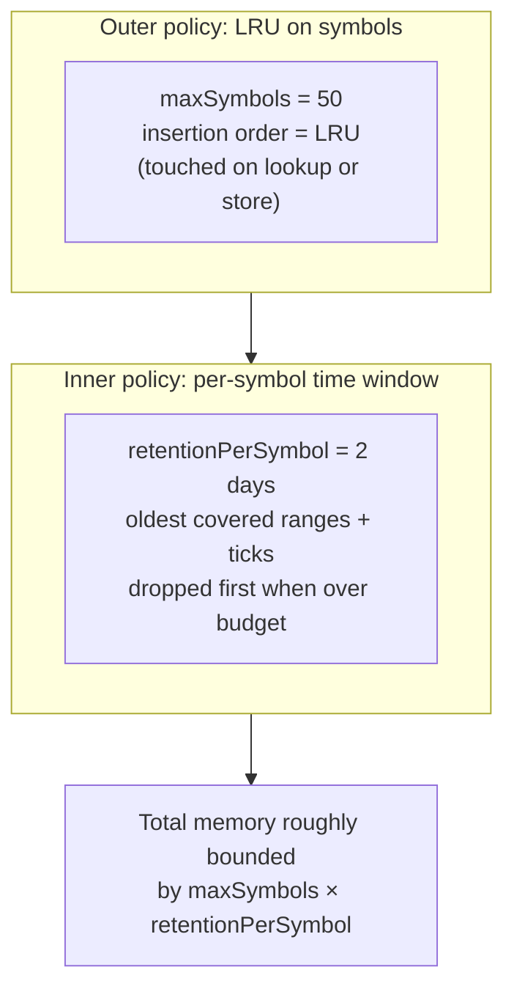

Together this caps memory at about
`maxSymbols × retentionPerSymbol` worth of data regardless of usage
patterns. The chart is biased toward recent data, so dropping the
oldest covered slices first keeps the most-likely-needed data warm.

### What a `lookup()` returns

The cache doesn't just return ticks — it returns a `CacheLookup`
record that lets the repository do **partial fetches**:

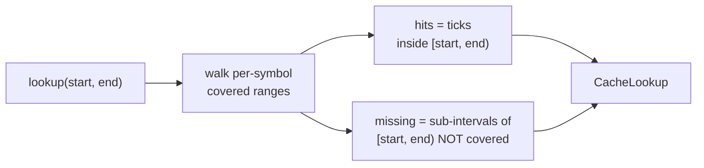

So if the user previously loaded `[T-24h, T-12h]` and now asks for
`[T-24h, T)`, the cache returns the existing 12 h of ticks plus a
single `[T-12h, T)` missing range — the repository only fetches the
12 h gap.

### Concrete example

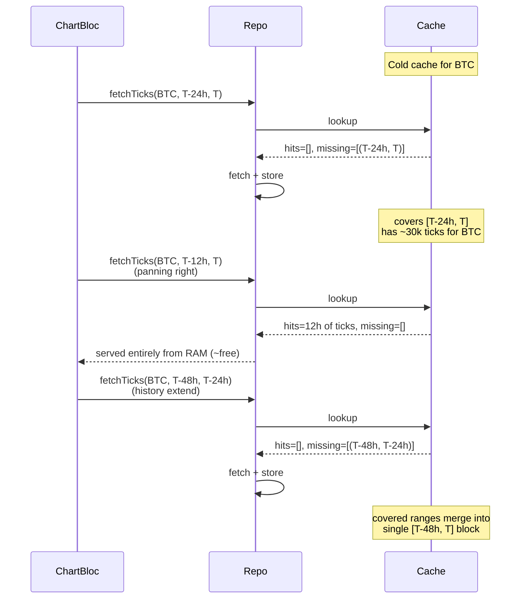

Two important details:

- The covered range is set explicitly when storing (rather than
  inferred from min/max tick timestamp), so a contiguous range with
  zero ticks in it (e.g. a paused interval) still counts as covered
  and won't be re-asked.
- `_mergeRanges()` merges overlapping or touching covered ranges into a
  minimal sorted set, so the diff-against-missing loop is `O(R)` over a
  small `R`.

### Invalidation

A debug dial event for `setPriceOffset(symbol, …)` does **not**
invalidate the cache. The whole point of the time-aware offset model
is that past ticks keep the offset they were synthesised with, so
cached ticks remain accurate. The repository exposes
`invalidate(symbol)` for any future case where the curve really did
shift retroactively (e.g. a coin re-quote), but it isn't called on
the dial path today.

---

## Merging Live + Historical on the Chart

This is the centrepiece of the system. The flow inside `ChartBloc`:

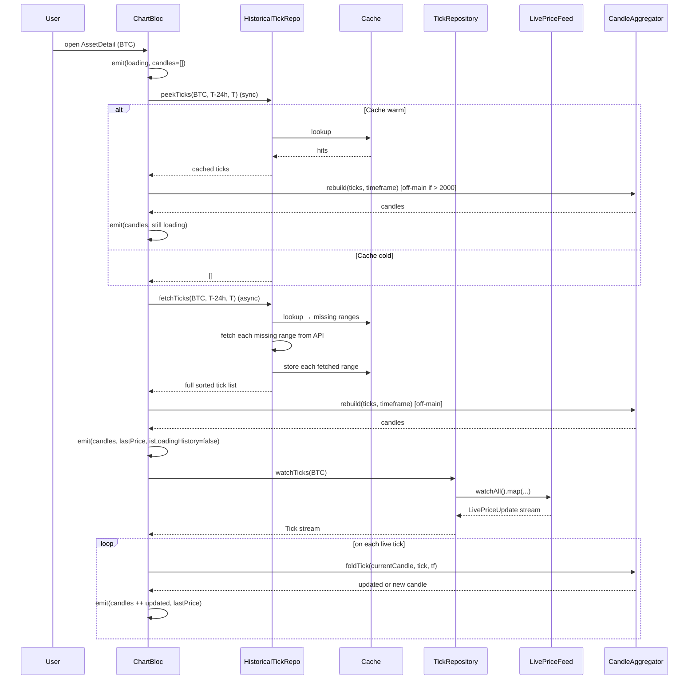

The seamless boundary comes from three contracts:

1. **Same `PriceNoise` for both planes** — the historical synthesizer
   asks the live feed for the symbol's `PriceNoise` and synthesizes
   off it. So the last historical tick at `T - 1 s` and the first live
   tick at `T` come from the same continuous curve.
2. **Same offset model for both planes** — the synthesizer reads
   `feed.offsetEvents(symbol)` once per dispatch and applies the offset
   that was active _at each tick's timestamp_. Live ticks apply the
   currently-active offset (which is, by construction, the offset
   active at "now"). So the offset semantics agree across the boundary.
3. **Single candle aggregator** — `CandleAggregator.rebuild` is what
   builds the historical candles, and `CandleAggregator.foldTick` is
   what extends the latest candle from a live tick. They share the
   same bucket-flooring logic (`bucketStart`), so a live tick that
   arrives mid-bucket extends the historical candle the bloc just
   finished rendering — no flicker, no reset.

### What the bloc does NOT do

To keep the merge correct under every edge case, the bloc deliberately
**does not**:

- Mutate `_tickHistory` when a debug offset is dialed (the past stays
  bit-for-bit identical).
- Invalidate the cache on a dial event.
- Re-fetch history on a timeframe change — only `rebuild(...)` runs,
  off-main, against the same in-memory tick deque.

### Pause gaps

When the user pauses the live feed, wall-clock time keeps advancing.
On resume the bloc inserts a `PauseGap` and re-runs `mergeGaps(...)`
to splice "DATA UNAVAILABLE" candle slots in. A subsequent
`BackfillRequested` event fetches ticks from the historical API across
each gap and rebuilds the candles. Because the historical API can
synthesize any range, the gap fills cleanly with the same noise curve
that produced the surrounding live data.

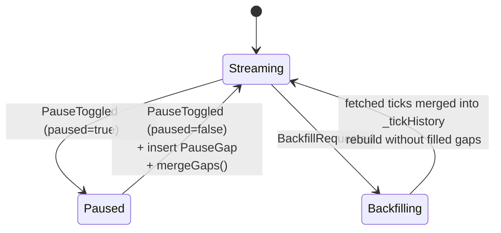

---

## The Sparkline Path (Markets List)

The markets list shows a tiny 24 h sparkline next to every row. Doing
this naively (one bloc subscription per row, full historical fetch per
row) would tank the UI. `SparklineFeed` is purpose-built for this:

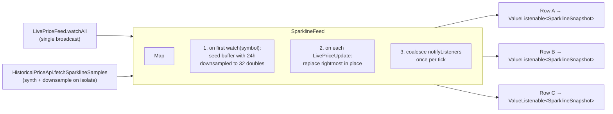

Why "replace rightmost" instead of "push and trim":

- The buffer is seeded with 32 evenly-spaced points spanning 24 h. If
  we pushed every live tick we'd cycle through those 32 slots in ~20 s
  and the sparkline would degrade from "trailing 24 h" into "last 32
  live ticks". Replace-in-place keeps the macro shape intact while
  letting the right edge track current price.

`RepaintBoundary` around each sparkline widget plus the
`ValueListenable` per symbol means only rows whose price actually
changed repaint — not the whole list.

---

## Chart Events: Add, Read, Poll

Events (the chart's annotation markers — "Spot ETF inflow exceeds
$500 M", etc.) are the only data plane in the app that talks to a real
backend.

### Topology

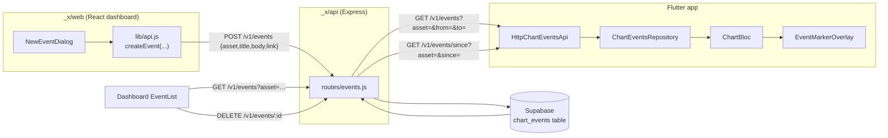

### Two intentional read shapes

The events API splits "read" into two URLs because they have
different semantics and the split forces clients to be intentional:

| Endpoint               | Order  | Bound                | Used by                           |
| ---------------------- | ------ | -------------------- | --------------------------------- |
| `GET /v1/events`       | `desc` | `[from, to]`         | Dashboard list, Flutter init load |
| `GET /v1/events/since` | `asc`  | `created_at > since` | Flutter 1 s delta poll            |

The delta endpoint is **strict-greater-than** so the cursor is just
"the timestamp of the last event we've seen" — no off-by-one fudging.

### Adding an event (write path)

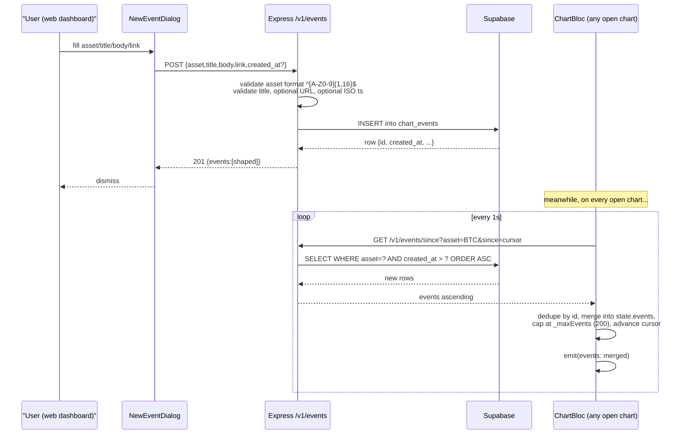

Two practical consequences:

- A new event posted from the dashboard appears on every open chart in
  ≤ 1 s.
- Deletions are not seen by the chart polling channel — only inserts.
  The dashboard re-fetches its window after every delete to refresh
  itself, but a Flutter chart already showing a deleted event will
  keep showing it until the user navigates away and back. This is
  acceptable today because the dashboard is the only writer and edits
  are append-only. A real-time push channel (Supabase Realtime) would
  be the upgrade path.

### Reading on initial load + history extend

```mermaid
sequenceDiagram
    participant Bloc as ChartBloc
    participant Repo as ChartEventsRepository
    participant Api as HttpChartEventsApi
    participant Server as Express /v1/events

    Note over Bloc: ChartStarted / SymbolChanged
    par parallel with tick fetch
        Bloc->>Repo: fetchEventsInRange(BTC, T-24h, T, limit=200)
        Repo->>Api: same
        Api->>Server: GET /v1/events?asset=BTC&from=…&to=…&limit=200
        Server-->>Api: 200 {events:[…]} (desc)
        Api->>Api: parse, attach neutral icon/color/label,<br/>sort ascending
        Api-->>Bloc: List<MarketEvent>
    and tick fetch
        Bloc->>Bloc: fetchTicks + rebuild candles
    end
    Bloc->>Bloc: emit(candles, events, …)
    Bloc->>Bloc: schedule 1s poll with cursor=T

    Note over Bloc: HistoryExtendRequested
    Bloc->>Repo: fetchEventsInRange(BTC,<br/>earliestTick, now, limit=200)
    Note over Bloc: Refetch over the wider window;<br/>reset poll cursor to "now"
```

The bloc deliberately **runs the events fetch in parallel** with the
tick fetch on initial load — they're independent network calls so
there's no reason to serialise. The candles always render first
because rebuild + sort is heavier than parsing the events JSON.

### Cursor advancement

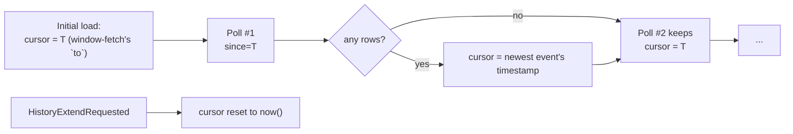

Two important guards in the poll handler:

- If the symbol was switched while a poll was in-flight, the response
  is dropped on return.
- If the bloc was closed between the timer firing and the handler
  running, `isClosed` short-circuits before any `add` (which would
  otherwise throw `StateError: Cannot add new events after calling
close`).

---

## Concurrency & Off-Main-Thread Work

Hot paths that go through `runOffMain` (ours own
`compute`-shaped wrapper):

| Task                                | When                                           | Threshold             |
| ----------------------------------- | ---------------------------------------------- | --------------------- |
| `_synthesizeTicksWorker`            | Historical fetch                               | ~2000 estimated ticks |
| `_synthesizeSparklineSamplesWorker` | Sparkline seed                                 | Same                  |
| `rebuildCandlesWorker`              | Initial load, timeframe change, history extend | 2000 ticks            |

Below the threshold, the inline path runs synchronously on the main
thread — the fixed cost of an isolate spin-up dominates the work.
Above it, the isolate hop is a clear net win.

A subtle optimisation: when `rebuildCandlesWorker` is called with
non-empty `gaps`, it runs `mergeGaps` **inside the same isolate hop**
so the bloc receives a fully-finished candle list. The previous
implementation rebuilt off-main and then re-touched the result on the
main thread to splice gaps, doubling the per-frame cost on long
sessions.

The K-way merge inside `CachedHistoricalTickRepository._mergeSortedRuns`
is also worth calling out — it keeps the post-fetch merge linear in
total tick count, instead of `O(N log N)` from a naïve `..sort()` over
the concatenation. On a 24 h fetch (~30 k ticks per page) this is the
difference between dropping a frame and a smooth page-turn.

---

## Efficiency Opportunities

The following are concrete wins we could make. Each row lists what,
why, and a rough implementation cost.

| #   | Opportunity                                                                                                                                                                                                                                                                                                                                                                                       | Why it matters                 | Cost |
| --- | ------------------------------------------------------------------------------------------------------------------------------------------------------------------------------------------------------------------------------------------------------------------------------------------------------------------------------------------------------------------------------------------------- | ------------------------------ | ---- |
| 1   | **Incremental `foldTick` instead of full deque copy** in `_onTickReceived`. Currently we copy `state.candles` on every live tick. With a 1 s tick rate and 1440 1-m candles/day this is fine, but copying becomes visible at 1m+ candles after several pages of history extend. Switch to a single-tail mutation (`copyWith` only the last candle) and emit a state with a partial-update marker. | Tick-rate frame cost           | S    |
| 2   | **Promote `OffsetEvent` lookup to binary search** if event lists ever exceed ~32. Current linear walk is fine for typical sessions (a handful of dials) but gets quadratic if events accumulate per symbol over a long session. Cheap upgrade behind the same API.                                                                                                                                | Long-session safety            | S    |
| 3   | **Persist `HistoricalTickCache` to disk** (e.g. Hive box keyed by symbol). Today the cache is in-memory only; a cold start re-synthesizes the same 24 h window we showed yesterday. Disk persistence + a small max-age would make warm starts instant.                                                                                                                                            | Cold-start UX                  | M    |
| 4   | **Real-time event push via Supabase Realtime** to replace the 1 s poll. The poll is already cheap (empty payload when nothing changed), but it adds 1 round-trip × N open charts × 1 Hz. Realtime would give us push semantics and surface deletions through the same channel.                                                                                                                    | Network + correctness          | M    |
| 5   | **Server-side `since` index on `chart_events.created_at`** if we ever scale past a few thousand rows per asset. Today the table is tiny, but a B-tree index makes `since` queries O(log N) on the worst day.                                                                                                                                                                                      | Backend correctness at scale   | XS   |
| 6   | **De-bounce `LivePriceUpdate` on hidden screens.** The home, markets, portfolio, and chart screens all subscribe; while one is foregrounded the others keep rebuilding. A `RouteAware` guard on the bloc subscriptions would drop offscreen work to zero.                                                                                                                                         | Battery, sustained CPU         | M    |
| 7   | **Bound `_maxTickHistory` more tightly + keep candles, drop ticks** once the user has paged past a window. Today we keep up to 200 k raw ticks in the bloc deque as a safety net. Once a candle is closed and committed, we don't need the underlying ticks anymore unless the user changes timeframe — and even then, we only need them for the _visible_ range.                                 | Memory cap                     | M    |
| 8   | **Coalesce candle rebuilds on rapid timeframe toggles.** Repeated timeframe taps within ~150 ms today fire one isolate per tap. Debounce to one rebuild for the latest selection.                                                                                                                                                                                                                 | Battery on stress test         | S    |
| 9   | **Switch the bloc-internal `_eventCursor` watermark to a "max seen id"** and move the server query to `id > cursor`. Timestamp ordering breaks down if two events share a `created_at` (rare with `now()` but possible if the dashboard backdates).                                                                                                                                               | Correctness edge case          | XS   |
| 10  | **Batch missing-range fetches** in `CachedHistoricalTickRepository.fetchTicks`. Currently each missing range is awaited serially; fan them out with `Future.wait` so the latency budget is the slowest range, not the sum.                                                                                                                                                                        | First-paint on a partial cache | S    |

A defensible interview answer to "what's next" is items 3, 4, 6, 10 —
they're the four with user-visible impact and the most architecturally
interesting trade-offs.

---

## Unit Test Plan

The interview brief calls out unit tests against business logic. Here
is what is in tree today and what is worth adding next, organised by
subject under test.

### Already covered (see `test/`)

- `test/data/services/historical_tick_cache_test.dart` — empty lookup,
  full coverage, partial coverage with gaps, LRU eviction, retention
  trimming.
- `test/data/services/historical_price_api_test.dart` — synthesis
  density per age tier, deterministic against fixed seed.
- `test/data/services/live_price_feed_test.dart` — broadcast on tick,
  offset event append-only behaviour, paused/resumed semantics.
- `test/data/services/sparkline_feed_test.dart` — seed-then-replace
  contract, no live drift past 24 h shape.
- `test/data/services/candle_aggregator_test.dart` — fold idempotence,
  bucket flooring, gap merging.
- `test/blocs/chart_bloc_test.dart` — initial load, symbol switch,
  fills delivery (events poll stubbed).

### Gaps worth filling

For an interview-quality coverage story, add these focused tests. Each
bullet is one test name in `Given/When/Then` shape.

#### `LivePriceFeed`

- _Given a paused feed when `setPriceOffset` is called then a single
  immediate `LivePriceUpdate` is emitted with the new offset baked
  into `prices`._ Verifies the dial bypasses the pause.
- _Given two offset events at t1 < t2 when `priceAt` is queried at t1−ε,
  t1, t2−ε, t2, t2+ε then offset is 0, e1, e1, e2, e2 respectively._
  Locks in the step-function semantics.
- _Given an unknown symbol when `currentPrice` is called then a
  deterministic price is returned and a `PriceNoise` is registered._
  Lazy-registration contract for paginated assets.

#### `MockHistoricalPriceApi`

- _Given a window crossing two age tiers (≤1 h then 1 h–1 d) when
  `fetchTicks` is called then tick interval is dense at the recent end
  and sparse at the old end._ Density schedule.
- _Given offset events at t1, t2 when `fetchTicks` spans
  `[t1−h, t2+h]` then ticks before t1 have offset 0, ticks in `[t1,t2)`
  have e1 baked in, and ticks `≥ t2` have e2._ The merge-with-history
  contract.
- _Given start ≥ end when called then an empty list is returned and the
  isolate is not spawned._ Trivial-input short-circuit.

#### `HistoricalTickCache`

- _Given two non-overlapping stores when a third store is added that
  bridges them then `_mergeRanges` collapses to a single covered
  range._ Range-merge correctness.
- _Given retention < total stored span when a new store is added then
  the oldest range and its ticks are dropped first._ Eviction order.
- _Given `maxSymbols = 2` and two stored symbols when a third symbol
  is stored then the LRU symbol is evicted._ LRU policy.
- _Given a covered range with zero ticks when the same range is
  queried then `missing` is empty and `hits` is empty._ Empty-but-
  covered semantics — the cache must not re-fetch.

#### `CachedHistoricalTickRepository`

- _Given a partial cache when `fetchTicks` is called then exactly the
  missing sub-ranges are passed to the underlying API._ Re-use
  property.
- _Given two missing ranges and an unsorted underlying API mock when
  `fetchTicks` resolves then the returned list is sorted ascending._
  Sort stability.
- _Given the underlying API throws when `fetchTicks` is called then
  the exception is propagated and the cache is not poisoned._ Error
  isolation.

#### `CandleAggregator`

- _Given a tick on the boundary `t == bucketStart` when folded then it
  opens a new candle (not extends the previous)._ Bucket boundary.
- _Given a `Candle.gap` as `current` when `foldTick` is called then a
  fresh candle is opened._ Already covered, but call out the contract.
- _Given gaps that overlap candles when `mergeGaps` is called then the
  output's slot count is `min(ceil(gap/tf), 5000)`._ Cap on long
  pauses.

#### `ChartBloc` event flow (the part not yet covered)

- _Given an empty state when `ChartStarted` is dispatched then exactly
  one events-window fetch is issued and the cursor is set to the
  window's `to`._ Initial-load contract.
- _Given a delta poll returning rows whose timestamps duplicate
  existing ids when `_EventsPollTicked` is processed then no
  duplicates appear in `state.events` and the cursor still advances._
  Idempotence.
- _Given the bloc is closed mid-poll-flight when the await resolves
  then no `add` is called._ `isClosed` guard.
- _Given `state.symbol` switched mid-poll-flight when the await
  resolves then `state.events` is unchanged._ Stale-poll drop.
- _Given `HistoryExtendRequested` when the older fetch returns ticks
  then the events cursor is reset to `now`._ Cursor invariant after
  history extend.
- _Given `setPriceOffset` is called when a live tick arrives then the
  next folded candle reflects `noise(now) + newOffset`, but
  `_tickHistory` is unchanged from before the dial._ Past-stays-frozen
  invariant.

#### `ChartEventsApi` (HTTP shape)

- _Given a 200 OK with shape `{events:[…]}` when `_fetch` is invoked
  then events are sorted ascending regardless of server order._
- _Given a 502 from the server when the fetch resolves then an empty
  list is returned and no exception escapes._ Graceful degradation.
- _Given a malformed row (missing `id`/`timestamp`) when parsed then
  it is skipped silently (with a debug print) instead of throwing._

These bullets, in order, would give us a defensible
"every public method on every business class is covered" story
without ballooning the test suite.

---

## Glossary

| Term              | Meaning                                                                                                                   |
| ----------------- | ------------------------------------------------------------------------------------------------------------------------- |
| **Tick**          | One price observation `{price, side, volume, timestamp}`.                                                                 |
| **Candle**        | OHLC bucket over a `Timeframe` interval, plus volume.                                                                     |
| **OffsetEvent**   | One step in the per-symbol price-pump history `{timestamp, offset}`.                                                      |
| **`PriceNoise`**  | Deterministic price-over-time function (Perlin macro + micro).                                                            |
| **Covered range** | A `[start, end)` interval the cache has already asked the API about.                                                      |
| **Pause gap**     | A wall-clock interval during which the live feed was paused; rendered as "DATA UNAVAILABLE" candles until backfilled.     |
| **Delta poll**    | Periodic `GET /v1/events/since?since=cursor` that returns only events created after `cursor`.                             |
| **Window fetch**  | One-shot `GET /v1/events?from=…&to=…` for a bounded interval.                                                             |
| **`runOffMain`**  | The thin `compute`-shaped wrapper that dispatches a function to a background isolate when input size crosses a threshold. |
